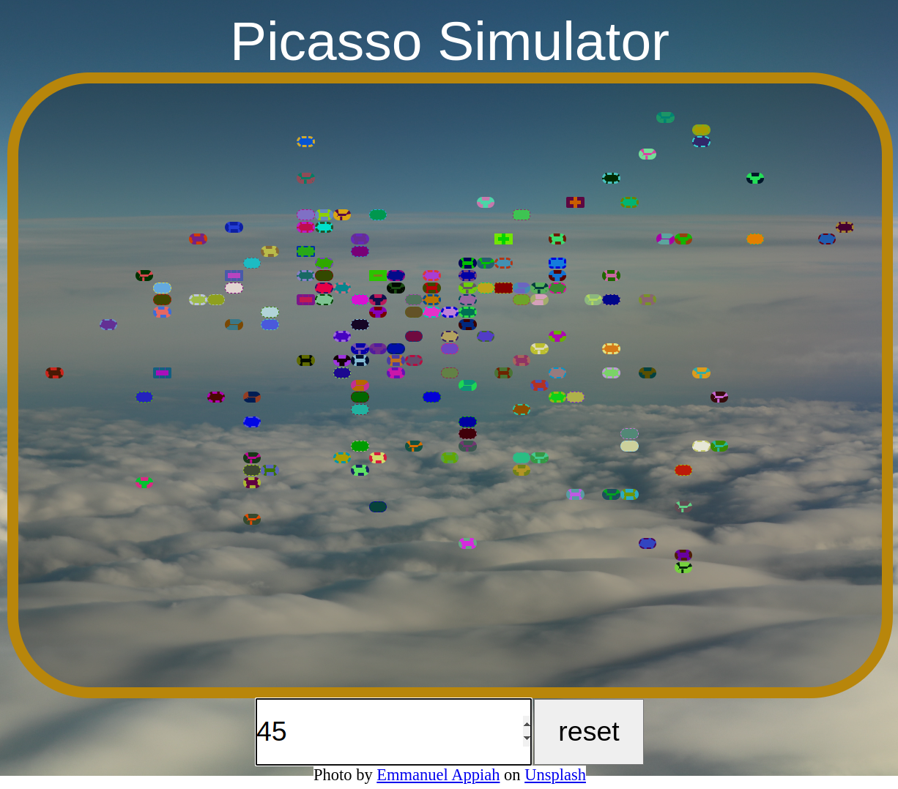

# Etch a Sketch

## What I Learned

- Learned to dynamically manipulate DOM styles through JavaScript.

## Features

- Users can choose the size of the canvas.
- Hovering over individual cells will apply several random styles to them, allowing users to draw.

## Running locally

1. Clone this repository.
2. Open `index.html` in your browser.

## Preview

