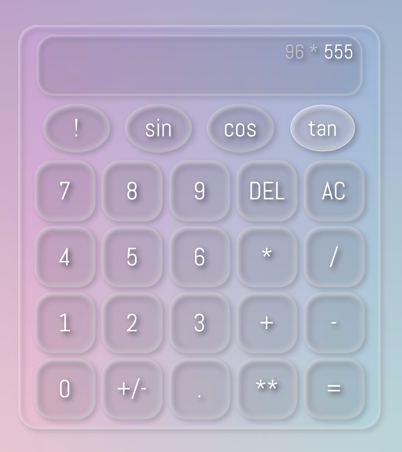

# Calculator

## What I Learned

- Learned to make my code cleaner, each function should be responsible for a single thing.

## Features

- Calculate numbers operation by operation.
- Supports various operators such as addition, factorial and others.
- Error handling in-case the user tries to divide by 0.

## Running locally

1. Clone this repository.
2. Open `index.html` in your browser.

## Preview

