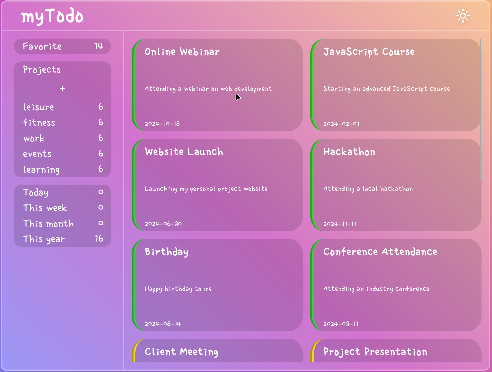

# Todo App

## What I Learned

- How to implement dark and light mode.
- Working with JSON data for the first time.
- Using media queries to make site responsive.
- Using LocalStorage.

## Features

- The app stores information in local storage, so changes are saved on refresh.
- Create and delete todos, mark as complete/favorite and change priority.
- Organise your todos into projects.

## Running locally

1. Clone this repository.
2. Run `npm ci` to install the dependencies.
3. Run `npm run start` and the project will open up in your browser.

## Preview

