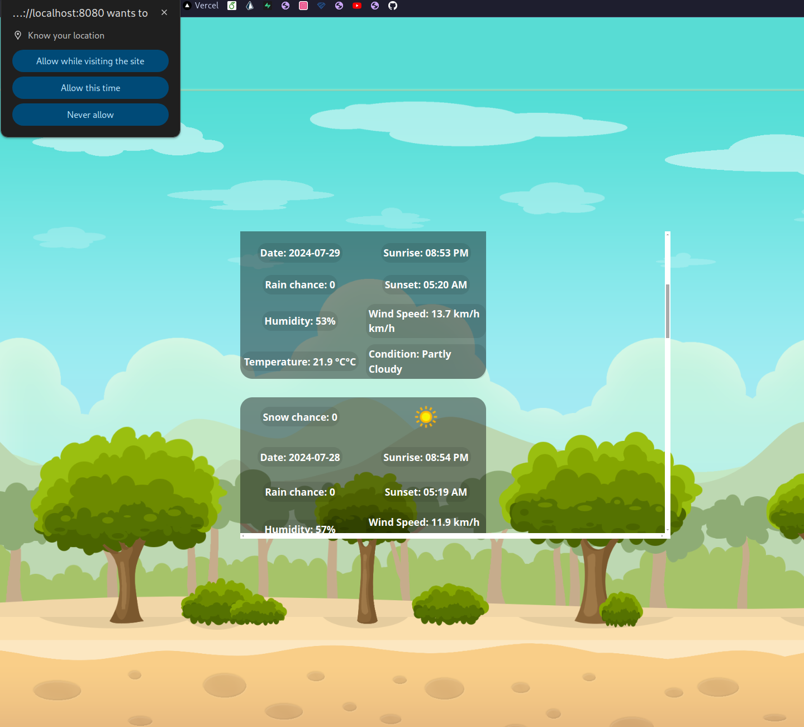

# Weather App

## What I Learned

- Asynchronous JavaScript (async/await and promises).
- Data fetching.
- Handling data.
- Using browser's Geolocation API to get the user's current location.

## Features

- Parallax effect from moving the mouse.
- Automatically fetches the user's location if they consent.
- Fetch weather data for a place and display it to the user.
- Supports both imperial and metric units.

## Running locally

1. Clone this repository.
2. Run `npm ci` to install the dependencies.
3. Run `npm run start` and the project will open up in your browser.

## Preview

