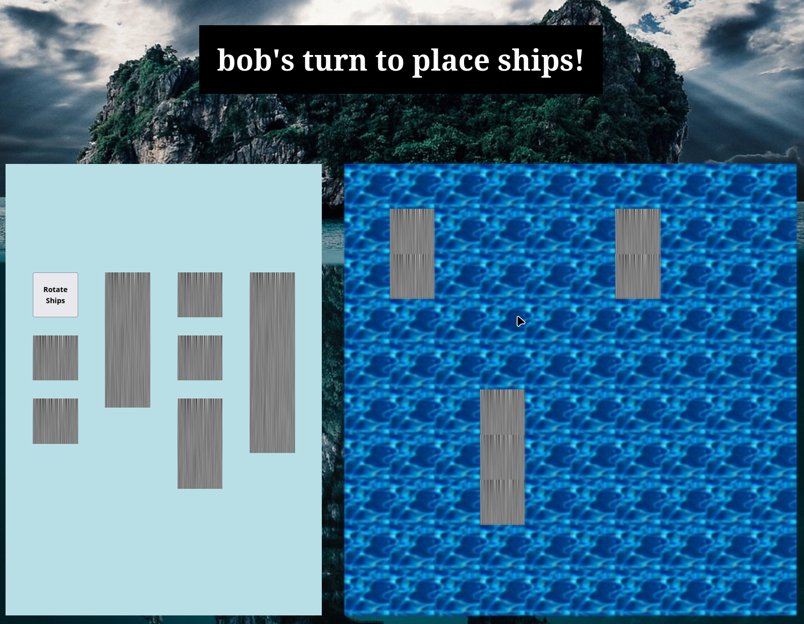

# Battleship

## What I Learned

- Learned how to unit test.
- Learned and used more advanced object-oriented patterns.
- Learned how to maintain a proper separation of concerns between code that is responsible for the game logic vs code that is responsible for manipulating the DOM.
- Learned how to use the native browser drag and drop API.

## Features

- Semi-intelligent AI
- Two player mode
- Drag and drop ships

## Running locally

1. Clone this repository.
2. Run `npm ci` to install the dependencies.
3. Run `npm run start` and the project will open in your browser.

## Preview

