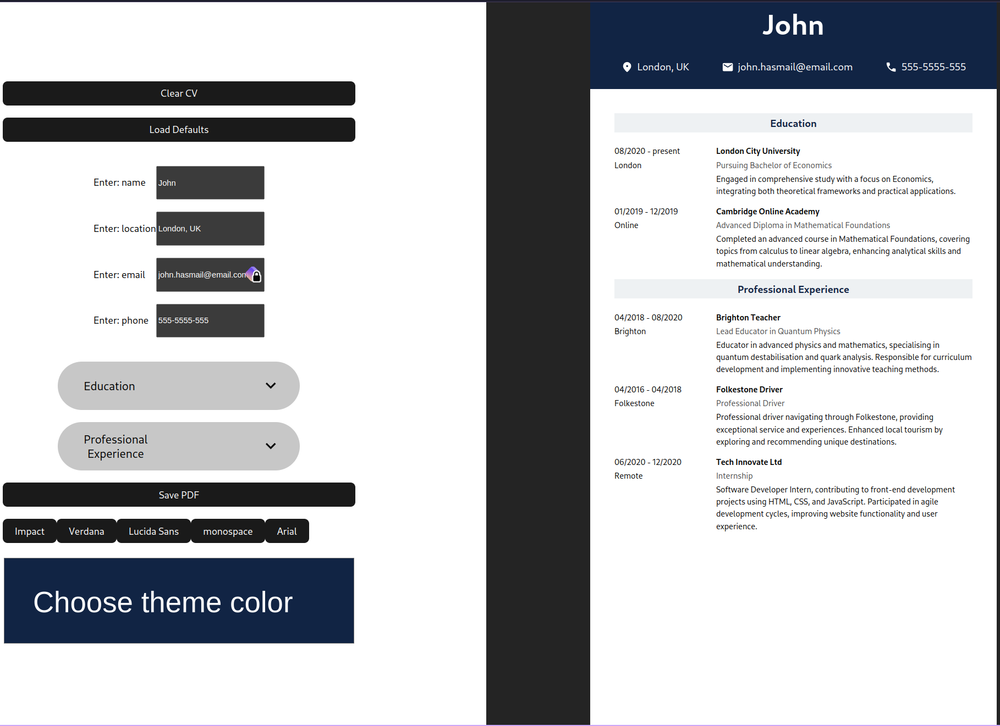

# CV Maker

## What I Learned

- Learned the basics of React and JSX.
- Learned how to handle state in React.
- Learned to use Vite.

## Features

- Build a CV by filling out the fields.
- Change font and color of the CV.
- The CV will always maintain the same aspect ratio.
- Exportable as a PDF.

## Running locally

1. Clone this repository.
2. Run `npm ci` to install all of the dependencies.
3. Run `npm run build` and head over to `localhost:5173`.

## Preview

