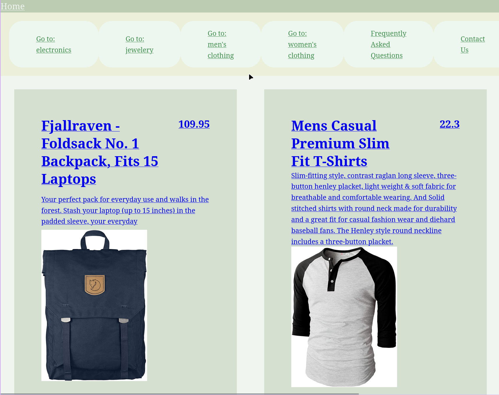

# Shopping Cart

## What I Learned

- Learned to create a single page application by using the React Router.
- Learned to set up dynamic routes with React Router.

## Features

- The website has categories, each category has several shop items.
- Each shop item is its own page, with the ability to add to cart.
- Cart state is saved across the application.

## Running locally

1. Clone this repository.
2. Run `npm ci` to install the dependencies.
3. Run `npm run dev` and head over to `localhost:5137`.

## Preview

