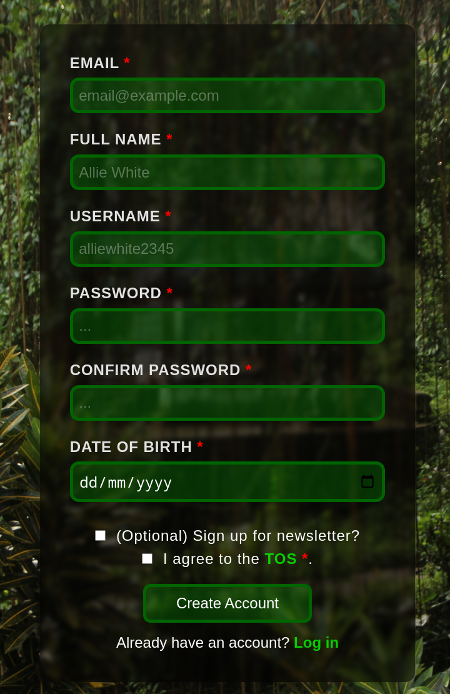

# Sign Up Form

## What I Learned

- Learned how to create forms with HTML.

## Features

- Sign up form with several fields, allowing the user to enter their nama, email, password and other fields.

## Running locally

1. Clone this repository.
2. Open `index.html` in your browser.

## Preview

