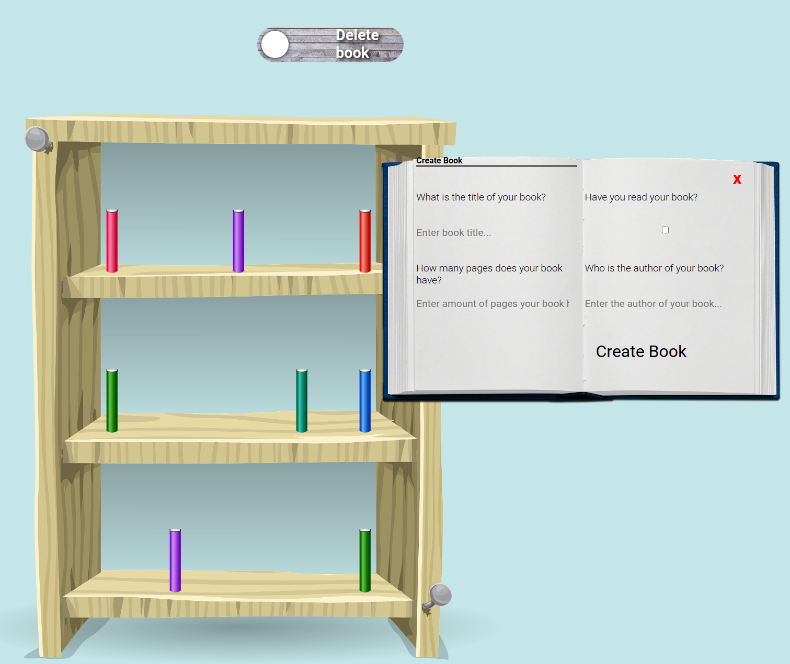

# Library

## What I Learned

- Basics of Object Oriented Programming.
- Absolute position.
- CSS transitions.

## Features

- Delete books from the library.
- Open books.
- Add new books.

## Running locally

1. Clone this repository.
2. Open `index.html` in your browser.

## Preview

