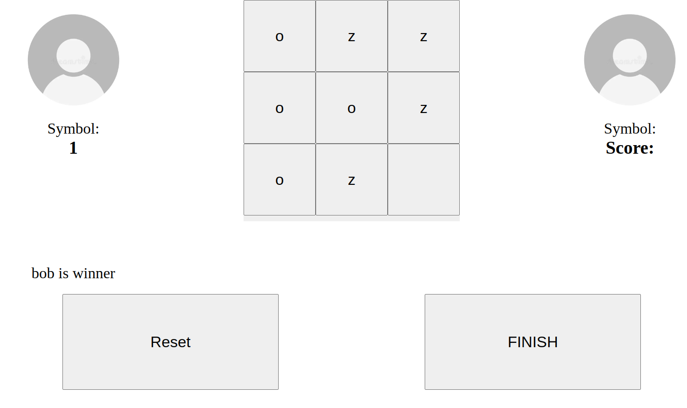

# Tic Tac Toe

Live: https://nikitarevenco.github.io/odin-project-tic-tac-toe

## What I Learned

- Learned principles of immutability by using an immediately invoking function expression (IIFE).

## Features

- Two players each can choose the letter they are playing as, their color and name.
- Winner's score increases by one.
- Players can finish the game early.
- Functionality to reset the game's state.

## Running locally

1. Clone this repository.
2. Open `index.html` in your browser.

## Preview

