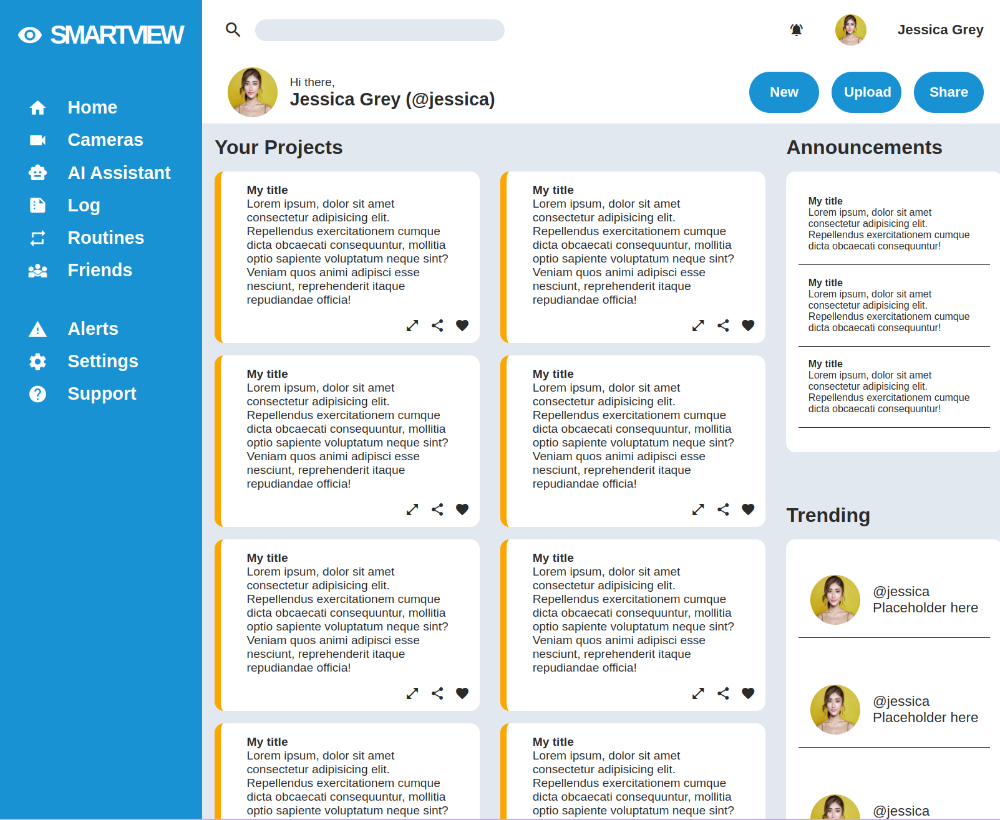

# Admin Dashboard

## What I Learned

- Learned how to use CSS Grid to create fluid grid layouts.

## Features

- Projects section.
- Side navigation.
- Various other sections.

## Running locally

1. Clone this repository.
2. Open `index.html` in your browser.

## Preview

