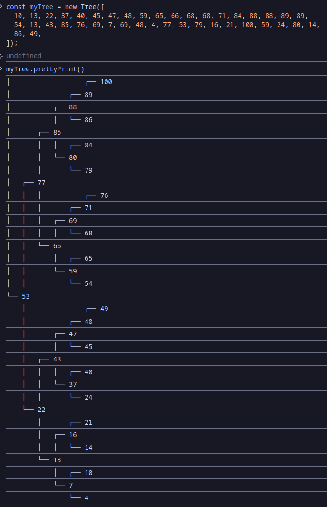

# Binary Search Tree

## What I Learned

- Learned how the binary search tree data structure works.

## Features

- Build a binary tree from an array with `const tree = new Tree(Array)`
- Traverse with `tree.inOrder(cb)`, `tree.preOrder(cb)`, `tree.postOrder(cb)` each of which are also able to take a callback function to manipulate data in the tree.
- Other methods such as `getLeaves` which returns all leaves, `isBalanced` which returns whether the tree is balanced, etc.

## Running locally

1. Clone this repository.
2. Open `index.html` in your browser.
3. Use the console to interact with the binary search tree.

## Preview

