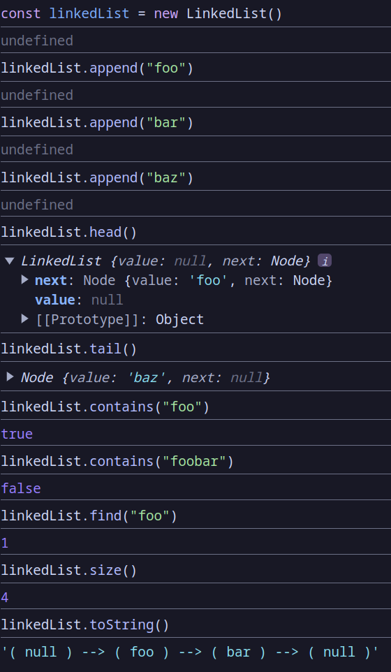

# Linked List

## What I Learned

- Learned about the linked list data structure

## Features

- Create linked list and perform various operations with them such as adding new items, removing, etc.

## Running locally

1. Clone this repository.
2. Open `index.html` in your browser.
3. Open the console to interact with the linked list.

## Preview

