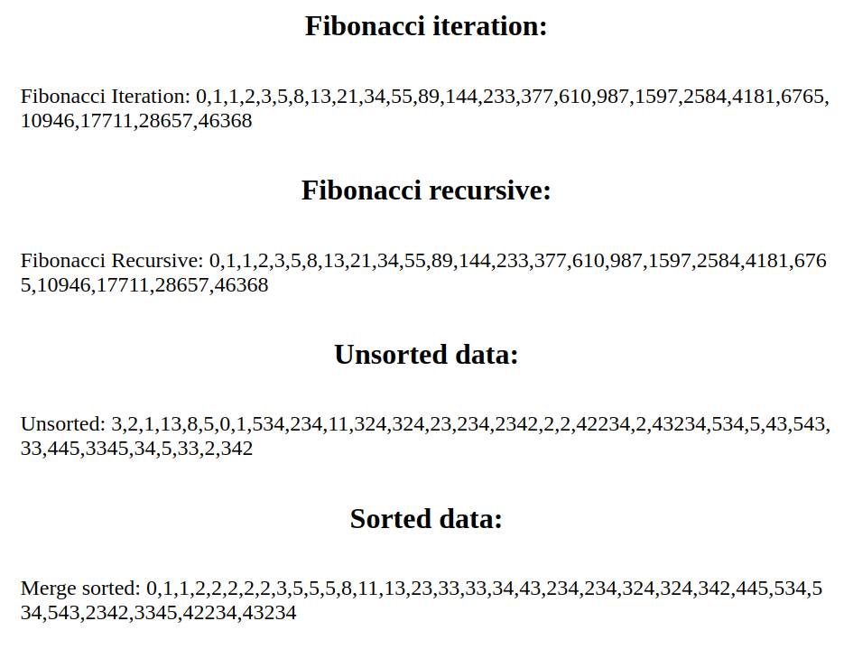

# Recursion

## What I Learned

- Learned how recursion works.
- Learned about merge sort.

## Features

- Generates an array of fibonacci numbers iteratively and recursively.
- Sorts an unsorted array using the merge sort.

## Running locally

1. Clone this repository.
2. Open `index.html` in your browser.

## Preview

