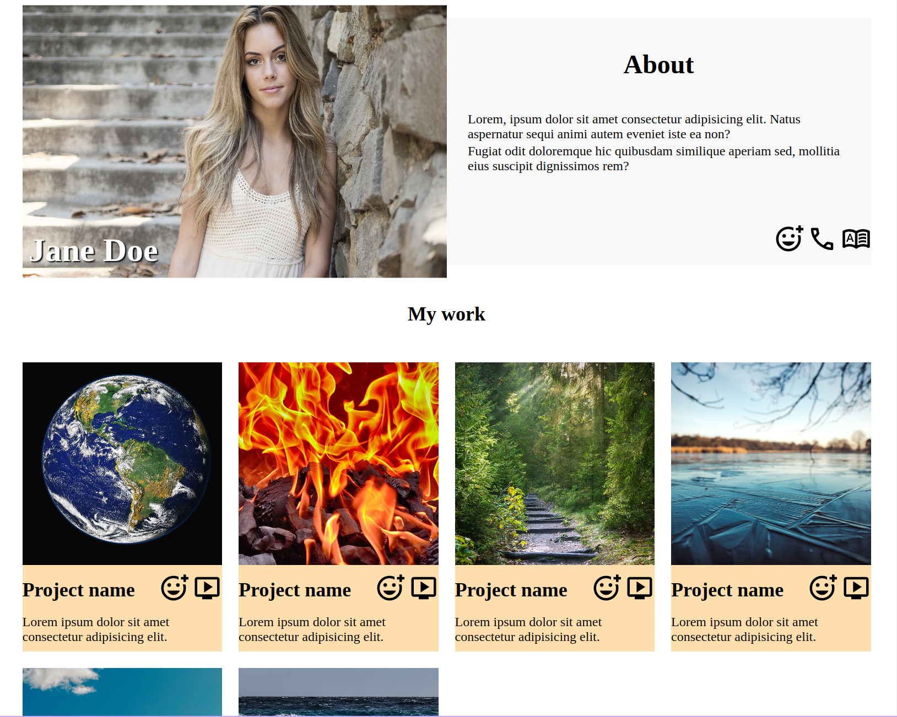

# Responsive Homepage

## What I Learned

- Learned how to implement responsive and fluid design.

## Features

- App is responsive and can be viewed on both desktop and mobile screens.

## Running locally

1. Clone this repository.
2. Open `index.html` in your browser.

## Preview

