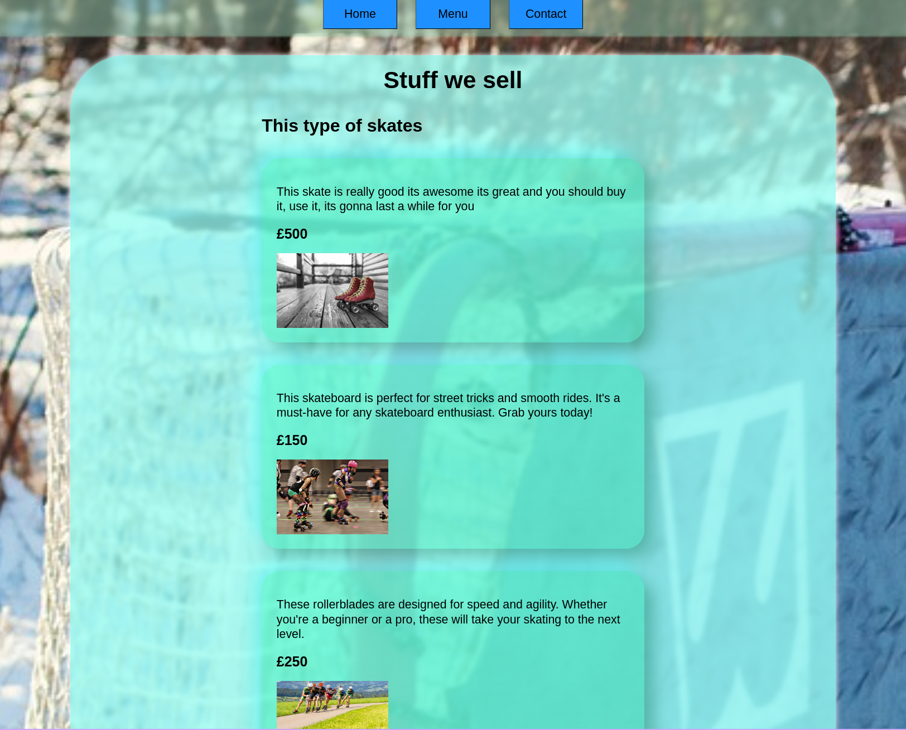

# Restaurant Page

## What I Learned

- Learned to use a bundler (webpack).
- Learned to use a package manager (npm).
- Created whole UI dynamically using only JavaScript, without writing almost any HTML.

## Features

- Several pages displaying information about the restaurant.

## Running locally

1. Clone this repository.
2. Run `npm ci` to install the dependencies.
3. Run `npm run start` and the project will open up in your browser.

## Preview

