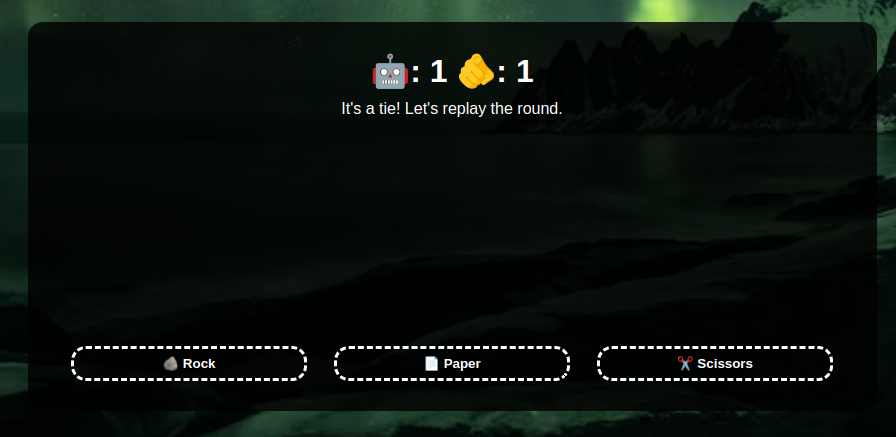

# Rock Paper Scissors

## What I Learned

- First time using JavaScript.
- Learned to manipulate the DOM for the first time.
- Learned how events work and how they can be listened to.

## Features

- Play rock paper scissors against the computer 5 times and find who will be the winner!

## Running locally

1. Clone this repository.
2. Open `index.html` in your browser.

## Preview

